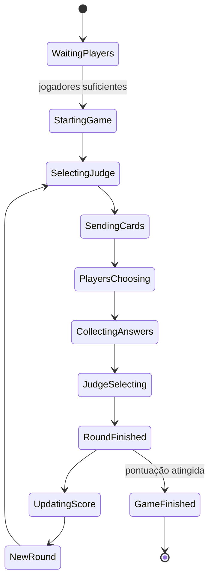
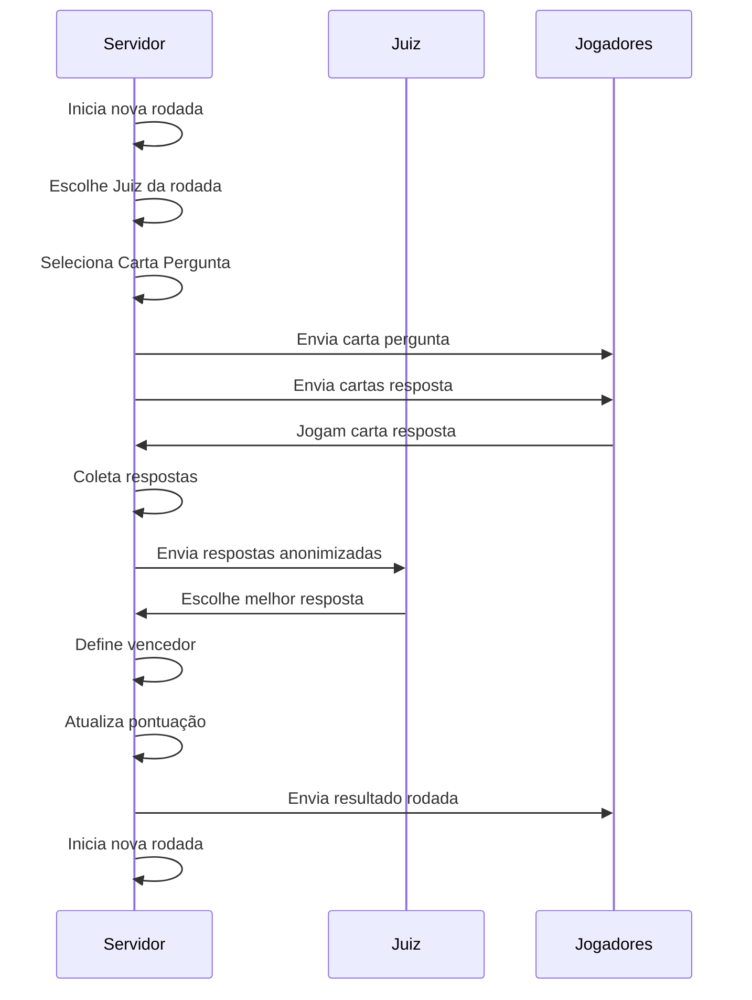

# State diagram

```mermaid
stateDiagram-v2

    [*] --> WaitingPlayers

    WaitingPlayers --> StartingGame : jogadores suficientes
    StartingGame --> SelectingJudge

    SelectingJudge --> SendingCards
    SendingCards --> PlayersChoosing

    PlayersChoosing --> CollectingAnswers

    CollectingAnswers --> JudgeSelecting

    JudgeSelecting --> RoundFinished

    RoundFinished --> UpdatingScore

    UpdatingScore --> NewRound

    NewRound --> SelectingJudge

    RoundFinished --> GameFinished : pontuação atingida

    GameFinished --> [*]
```

# Round flow diagram

```mermaid
sequenceDiagram
    participant Servidor
    participant Juiz
    participant Jogadores

    Servidor->>Servidor: Inicia nova rodada
    Servidor->>Servidor: Escolhe Juiz da rodada
    Servidor->>Servidor: Seleciona Carta Pergunta

    Servidor->>Jogadores: Envia carta pergunta
    Servidor->>Jogadores: Envia cartas resposta

    Jogadores->>Servidor: Jogam carta resposta
    Servidor->>Servidor: Coleta respostas

    Servidor->>Juiz: Envia respostas anonimizadas

    Juiz->>Servidor: Escolhe melhor resposta

    Servidor->>Servidor: Define vencedor
    Servidor->>Servidor: Atualiza pontuação

    Servidor->>Jogadores: Envia resultado rodada

    Servidor->>Servidor: Inicia nova rodada
```

