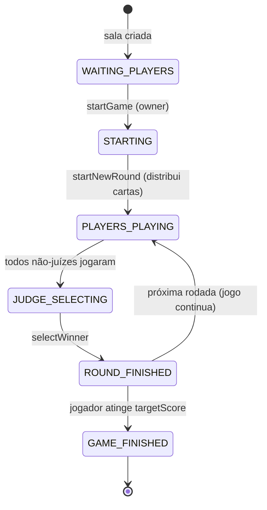
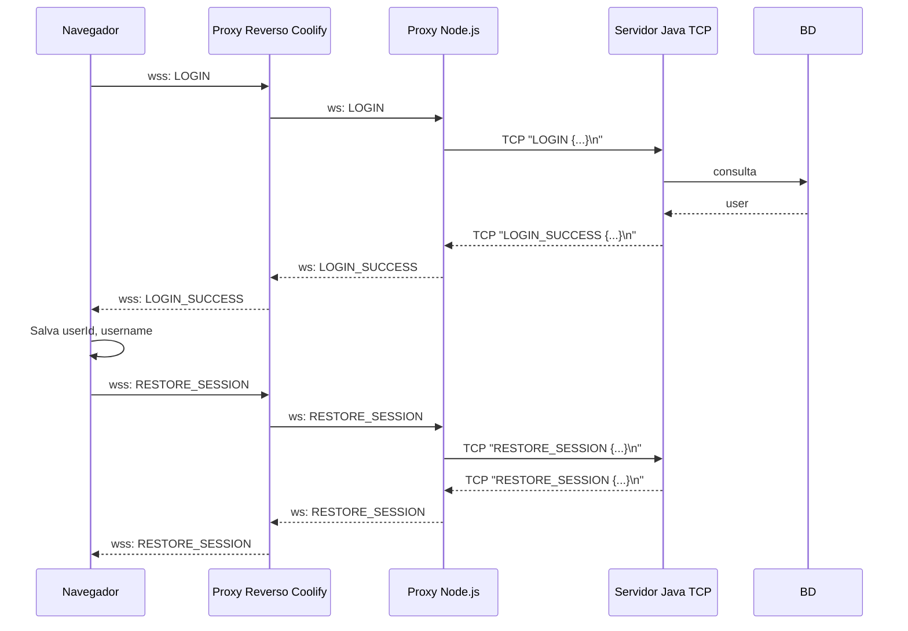
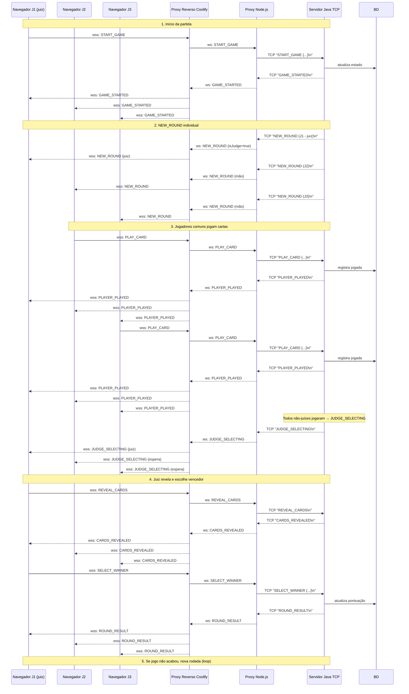
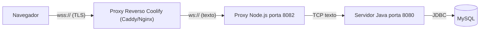
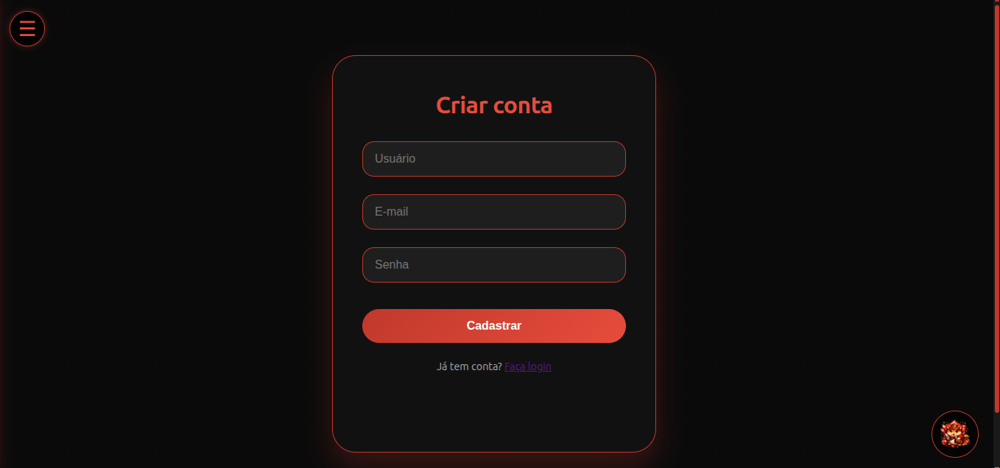
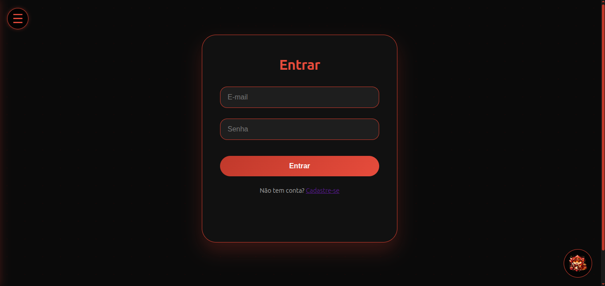
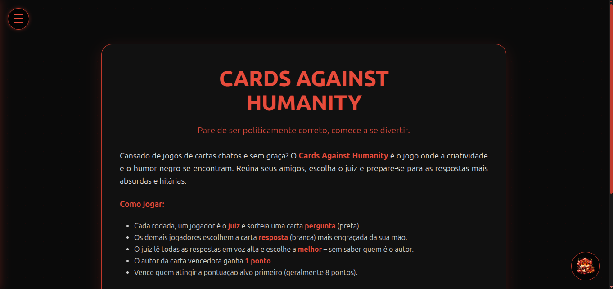
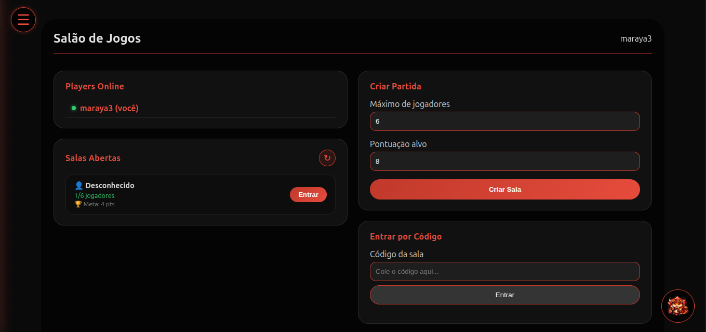
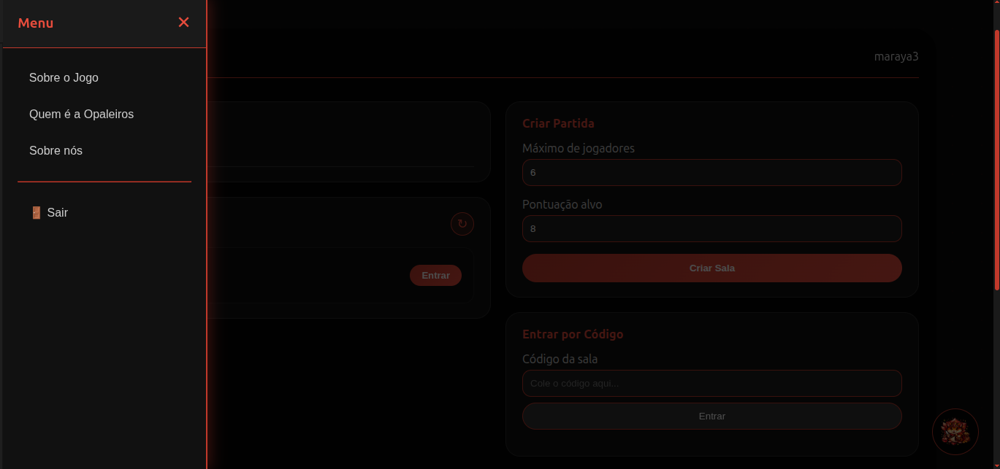
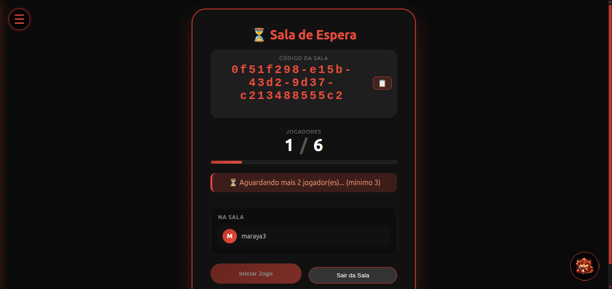

# Documentação Técnica – Cards Against Humanity

## Desenvolvedores

- Mariah Eduarda Pereira Bócoli
- Rhuan Esteves

## 1. Overview do Projeto

O **Cards Against Humanity** é um jogo multiplayer online onde um jogador (juiz) faz uma pergunta (carta preta) e os demais escolhem a resposta mais engraçada (carta branca) da sua mão. O juiz seleciona a melhor resposta anonimamente e o autor ganha um ponto. O jogo termina quando alguém atinge a pontuação alvo (padrão 8 pontos).

**Arquitetura geral:**

```
[Navegador] <-> [Coolify Proxy Reverso (HTTPS/WSS)] <-> [Proxy Node.js] <-> [Servidor Java TCP] <-> [MySQL]
```

- **Cliente web**: HTML5/CSS3/JavaScript puro. Comunicação via WebSocket (`wss://` em produção).
- **Proxy Node.js**: Converte WebSocket <-> TCP, serve arquivos estáticos.
- **Servidor Java**: TCP multithread com `EventBus` interno, JPA/Hibernate, lógica de jogo.
- **Banco de dados**: MySQL (gerenciado pelo Coolify ou container separado).

O Coolify gerencia automaticamente certificados SSL/TLS (Let's Encrypt) e o proxy reverso (Caddy/Nginx), garantindo criptografia na comunicação externa.

## 2. Componentes de Rede


| Componente                    | Função                                                        | Tecnologia                                       | Porta (padrão)        |
| ----------------------------- | --------------------------------------------------------------- | ------------------------------------------------ | ---------------------- |
| **Cliente web**               | Interface do usuário, envia/recebe mensagens JSON              | WebSocket (navegador)                            | 443 (wss) ou 8082 (ws) |
| **Proxy Reverso Coolify**     | Termina TLS, redireciona tráfego interno                       | Caddy/Nginx                                      | 443 (pública)         |
| **Proxy Node.js**             | Ponte WebSocket <-> TCP, serve arquivos estáticos              | Node.js +`ws`                                    | 8082 (interna)         |
| **Servidor Java**             | Lógica de negócio, lobby, partidas, persistência             | Java Sockets + JPA                               | 8080 (TCP, interna)    |
| **MySQL**                     | Armazena usuários, cartas, partidas, jogadores, cartas jogadas | JDBC / Hibernate                                 | 3306 (interna)         |
| **EventBus (broker interno)** | Desacopla recepção de mensagens da lógica de jogo            | Java`ConcurrentHashMap` + `CopyOnWriteArrayList` | –                     |

## 3. Protocolo de Comunicação

### Formato da mensagem (cliente <-> proxy <-> servidor)

```json
{"type":"TIPO","payload":{ ... }}
```

O servidor Java espera **uma mensagem por linha** (terminada com `\n`). O proxy Node.js garante essa formatação.

### Tipos de mensagem (cliente -> servidor)


| Tipo              | Payload exemplo                                                 | Descrição                      |
| ----------------- | --------------------------------------------------------------- | -------------------------------- |
| `REGISTER`        | `{"username":"joao","email":"joao@email.com","password":"123"}` | Criar conta                      |
| `LOGIN`           | `{"email":"joao@email.com","password":"123"}`                   | Autenticar                       |
| `RESTORE_SESSION` | `{"userId":"uuid","username":"joao"}`                           | Reconectar automaticamente       |
| `CREATE_GAME`     | `{"maxPlayers":6,"targetScore":8}`                              | Criar sala                       |
| `JOIN_GAME`       | `{"gameCode":"abc123"}`                                         | Entrar por código               |
| `REQUEST_JOIN`    | `{"gameId":"abc123"}`                                           | Pedir entrada via lista de salas |
| `APPROVE_JOIN`    | `{"requestId":"uuid"}`                                          | Dono aprova pedido               |
| `REJECT_JOIN`     | `{"requestId":"uuid"}`                                          | Dono rejeita                     |
| `LIST_OPEN_ROOMS` | `{}`                                                            | Listar salas aguardando          |
| `GET_GAME_INFO`   | `{"gameId":"abc123"}`                                           | Obter estado da sala             |
| `LEAVE_GAME`      | `{"gameCode":"abc123"}`                                         | Sair da sala                     |
| `START_GAME`      | `{"gameId":"abc123"}`                                           | Iniciar partida                  |
| `PLAY_CARD`       | `{"gameId":"abc123","cardId":"c42"}`                            | Jogar carta resposta             |
| `REVEAL_CARDS`    | `{"gameId":"abc123","playedCards":[...]}`                       | Juiz revela cartas               |
| `SELECT_WINNER`   | `{"gameId":"abc123","playedCardId":"pc99"}`                     | Juiz escolhe vencedor            |
| `CREATE_CARD`     | `{"text":"Minha carta","cardType":"ANSWER"}`                    | Criar carta customizada          |

### Tipos de mensagem (servidor -> cliente)


| Tipo               | Payload exemplo                                                                        | Quando enviado                          |
| ------------------ | -------------------------------------------------------------------------------------- | --------------------------------------- |
| `CONNECTED`        | `{"clientId":"..."}`                                                                   | Conexão aceita                         |
| `REGISTER_SUCCESS` | `{"userId":"..."}`                                                                     | Cadastro OK                             |
| `LOGIN_SUCCESS`    | `{"userId":"...","username":"..."}`                                                    | Login OK                                |
| `ERROR`            | `{"message":"..."}`                                                                    | Erro genérico                          |
| `GAME_CREATED`     | `{"gameId":"..."}`                                                                     | Sala criada                             |
| `PLAYER_JOINED`    | `{"gameId":"...","playerId":"...","username":"..."}`                                   | Broadcast: novo jogador                 |
| `GAME_STARTED`     | `{"gameId":"..."}`                                                                     | Jogo iniciado                           |
| `NEW_ROUND`        | `{"round":1,"judgeId":"...","isJudge":false,"questionCard":{...},"hand":[...]}`        | Enviado individualmente (mão própria) |
| `PLAYER_PLAYED`    | `{"playerId":"...","username":"..."}`                                                  | Alguém jogou                           |
| `JUDGE_SELECTING`  | `{"gameId":"...","round":1,"playedCards":[...]}`                                       | Todos jogaram – juiz escolhe           |
| `CARDS_REVEALED`   | `{"playedCards":[...]}`                                                                | Após`REVEAL_CARDS`                     |
| `ROUND_RESULT`     | `{"winningCardText":"...","winnerId":"...","username":"...","score":1,"scores":[...]}` | Fim da rodada                           |
| `GAME_FINISHED`    | `{"winningCardText":"...","winnerId":"...","username":"...","finalScores":[...]}`      | Fim do jogo                             |
| `OPEN_ROOMS`       | `{"rooms":[{"gameId":"...","playerCount":2,...}]}`                                     | Resposta a`LIST_OPEN_ROOMS`             |
| `JOIN_REQUEST`     | `{"requestId":"...","requesterName":"...","gameId":"..."}`                             | Pop‑up para o dono da sala             |
| `JOIN_ACCEPTED`    | `{"gameId":"..."}`                                                                     | Pedido aceito (redireciona)             |
| `JOIN_REJECTED`    | `{"gameId":"...","message":"..."}`                                                     | Pedido rejeitado                        |

## 4. Diagramas

### 4.1 Diagrama de Estado do Jogo (Máquina de Estados)



### 4.2 Diagrama de Sequência – Login e Restauração de Sessão



### 4.3 Diagrama de Sequência – Rodada Completa (3 jogadores)



### 4.4 Diagrama de Fluxo de Rede (com Coolify)



**Explicação do diagrama de fluxo de rede:**

No diagrama de fluxo de rede, o navegador do jogador estabelece uma conexão segura `wss://` com o proxy reverso gerenciado automaticamente pelo Coolify (Nginx), que é responsável por terminar o TLS e encaminhar o tráfego já descriptografado via WebSocket puro (`ws://`) para o proxy Node.js na porta interna 8082. Esse proxy, implementado em `proxy.js`, converte cada mensagem WebSocket em uma linha TCP terminada com `\n` e a envia ao servidor Java na porta 8080. O servidor Java processa a mensagem (acessando o MySQL via JDBC quando necessário) e devolve a resposta como uma linha TCP, que o proxy Node.js reconverte em mensagem WebSocket e envia de volta ao proxy reverso do Coolify, que a criptografa novamente e a entrega ao navegador. Dessa forma, a comunicação externa é protegida por TLS, enquanto a comunicação interna entre os componentes permanece em texto plano, isolada em uma rede privada do Coolify, garantindo segurança e simplicidade de deploy.

## 5. IPC (Inter-process Communication) e Payloads

### IPC no Servidor Java

- **Entre threads** (ClientHandler, EventBus, GameEventHandler, serviços): chamadas diretas a métodos e estruturas de dados compartilhadas (`ConcurrentHashMap` no `ClientRegistry`). Não há comunicação entre processos diferentes.
- **EventBus**: funciona como um **broker síncrono** dentro da mesma JVM. Os `ClientHandler` publicam eventos, e o `GameEventHandler` (registrado previamente) os consome.

### Exemplo de payload (NEW_ROUND) enviado individualmente:

```json
{
  "type": "NEW_ROUND",
  "payload": {
    "round": 2,
    "judgeId": "player-uuid",
    "isJudge": false,
    "questionCard": {
      "id": "q1",
      "text": "Por que cheguei atrasado: ___"
    },
    "hand": [
      { "id": "a5", "text": "Um PowerPoint de 200 slides" },
      { "id": "a8", "text": "Meu chefe dizendo 'rapidinho'" }
    ]
  }
}
```

### Payload de JUDGE_SELECTING (broadcast para todos, mas só o juiz interage):

```json
{
  "type": "JUDGE_SELECTING",
  "payload": {
    "gameId": "g123",
    "round": 2,
    "playedCards": [
      { "playedCardId": "pc1", "text": "Fingir que entendi a piada" },
      { "playedCardId": "pc2", "text": "Aquele silêncio constrangedor" }
    ]
  }
}
```

## 6. Justificativa das Bibliotecas de Rede

### Servidor Java


| Biblioteca                                                  | Função                       | Justificativa                                                                      |
| ----------------------------------------------------------- | ------------------------------ | ---------------------------------------------------------------------------------- |
| `java.net.ServerSocket` / `Socket`                          | TCP/IP                         | Nativa, baixo nível, controle total sobre o ciclo de vida das conexões.          |
| `java.util.concurrent` (ExecutorService, ConcurrentHashMap) | Pool de threads, concorrência | Necessário para suportar múltiplos clientes sem bloqueios.                       |
| **Gson**                                                    | Parsing/geração JSON         | Leve, rápida, integração simples. Escolhida em vez de Jackson por simplicidade. |
| **JPA/Hibernate**                                           | Mapeamento objeto‑relacional  | Abstrai o banco de dados (MySQL). Facilita troca de SGBD e mantém código limpo.  |
| **BCrypt**                                                  | Hashing de senhas              | Algoritmo seguro, resistente a ataques de força bruta.                            |

**Por que TCP e não UDP?**
O jogo exige entrega confiável e ordenação das mensagens. UDP exigiria implementação manual de confiabilidade (ACK, reordenação), o que não compensa.

### Proxy Node.js


| Biblioteca     | Função                   | Justificativa                                                                               |
| -------------- | -------------------------- | ------------------------------------------------------------------------------------------- |
| `ws`           | WebSocket server           | Biblioteca madura, compatível com a API nativa do navegador, fácil integração com HTTP. |
| `net` (nativo) | TCP client                 | Comunicação com o servidor Java na mesma rede interna.                                    |
| `http` + `fs`  | Servir arquivos estáticos | Permite um único processo servindo frontend e proxy.                                       |

**Por que um proxy?**
O servidor Java foi escrito para TCP puro, mas o navegador só fala WebSocket. Em vez de reescrever o servidor, o proxy atua como tradutor, mantendo o backend inalterado.

### Cliente Web


| Tecnologia                        | Função                   | Justificativa                                                     |
| --------------------------------- | -------------------------- | ----------------------------------------------------------------- |
| **WebSocket API**                 | Comunicação bidirecional | Baixa latência, ideal para jogos em tempo real.                  |
| **Vanilla JavaScript**            | Lógica do cliente         | Sem frameworks pesados, fácil manutenção, desempenho adequado. |
| **LocalStorage / SessionStorage** | Persistência de sessão   | Restaura sessão automaticamente sem novo login.                  |

## 7. Monitoramento e Depuração da Comunicação

### No servidor Java

- **Logs** com `java.util.logging`. Níveis configuráveis (`FINE` para mensagens detalhadas).
- **ClientRegistry**: fornece métodos para listar clientes conectados e seus usuários.
- **EventBus**: pode-se inspecionar o número de assinantes por evento.

**Comando para monitorar conexões TCP ativas (Linux):**

```bash
ss -tunap | grep 8080
```

### No proxy Node.js

- Adicione logs no `proxy.js`:

```js
ws.on('message', (message) => console.log('[PROXY] WS->TCP:', message.toString()));
tcpSocket.on('data', (data) => console.log('[PROXY] TCP->WS:', data.toString()));
```

- O Coolify fornece logs dos containers diretamente na interface web.

### No cliente web

- **Console do DevTools**: todas as mensagens recebidas são logadas (`console.log('[play.js] msg:', ...)`).
- **Aba Network → WS**: visualização em tempo real das mensagens WebSocket.

### Ferramentas externas


| Ferramenta       | Uso                                                                          |
| ---------------- | ---------------------------------------------------------------------------- |
| **Wireshark**    | Capturar pacotes TCP entre proxy e servidor Java (filtro`tcp.port == 8080`). |
| **Coolify logs** | Visualizar saída dos containers (Node.js e Java).                           |
| **telnet / nc**  | Simular um cliente TCP enviando comandos diretamente ao servidor Java.       |

## Evidência:

O pojeto roda no [Coolify](https://cards-against-humanity.opaleiros.xyz/login.html) e o fluxo para começar a jogar é

- Registro;
- Login;
- Sobre o Jogo;
- Lobby;
- Criar sala;
- Esperar jogadores;
- Iniciar jogo

Telas:














## Link do repositório:

https://gitlab.com/jala-university1/cohort-4/PT.CO.CSNT-245.GA.T1.26.M2/SA/equipe-1

### Link para as milestones:

https://gitlab.com/jala-university1/cohort-4/PT.CO.CSNT-245.GA.T1.26.M2/SA/equipe-1/-/milestones?sort=due_date_desc&state=closed


### Link para as Issues:
